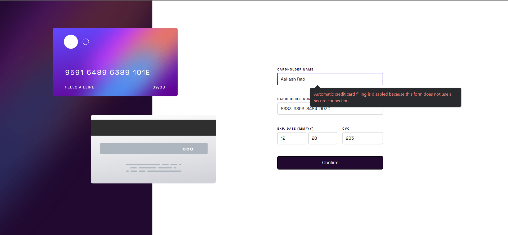
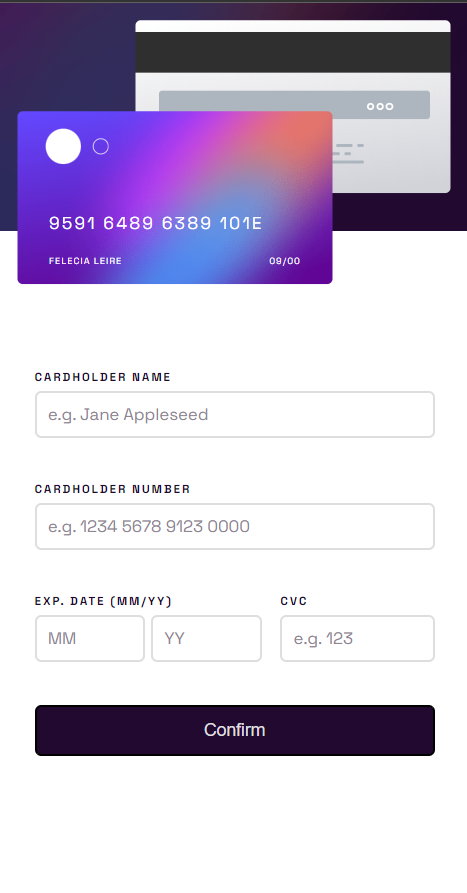

# Frontend Mentor - Interactive card details form solution

## A simple Overview

Challenge was moderate with the Vanilla CSS and JavaScript. I actually implemented the card number formatting and limits using a JavaScript library called Cleave.js

### The challenge

At first it seems to be easy but it took a while to break the logic of validation of the data that is being collected from the form.

### Screenshots

**Screenshot of the Desktop version**

**Screenshot of the Desktop Submitted version**

**Screenshot of the Mobile version**

### Links

- Solution URL: [Add solution URL here](https://your-solution-url.com)
- Live Site URL: [Add live site URL here](https://your-live-site-url.com)

## My process

### Built with

- HTML5
- Vanilla CSS
- Vanilla JavaScript
- JS Library (Cleave.js)
- Mobile-first workflow

### What I learned

To select closest parent element in DOM using `.closest` method.
